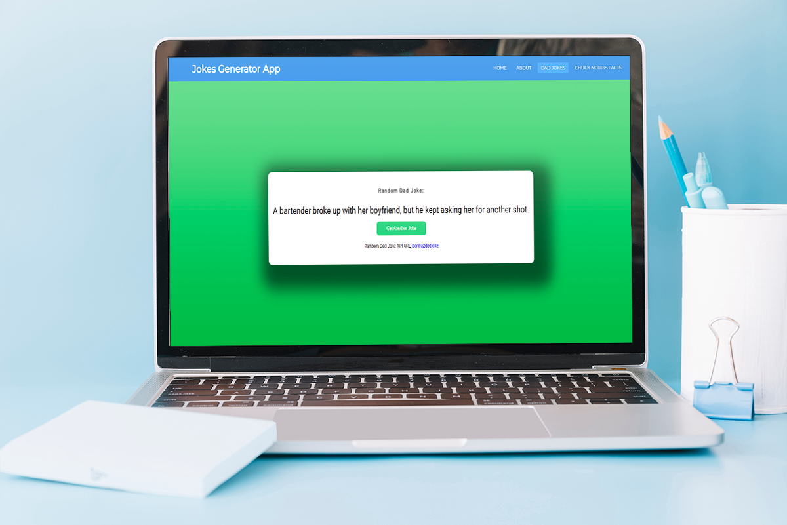

# Jokes-Generator-Application

Project Focus on Fetch API using JSON, AJAX

<h1 align="center">

</h1>

### Future Upgrades To Include

> Add More Joke API's

> Add Project Information in the Index and About Sections

- [x] ~~Added Dad Jokes API~~
- [x] ~~Added Chuck Norris API~~
- [ ] Refactor code

<h1 align="center">

</h1>
